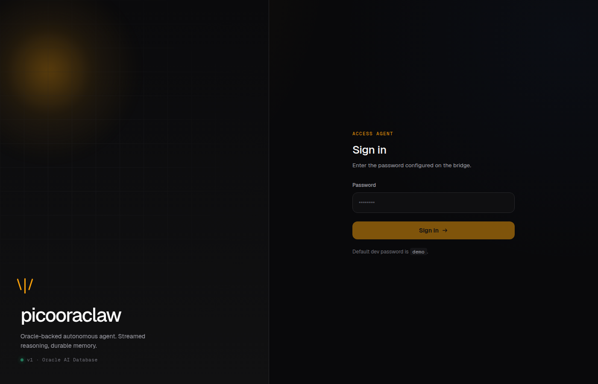
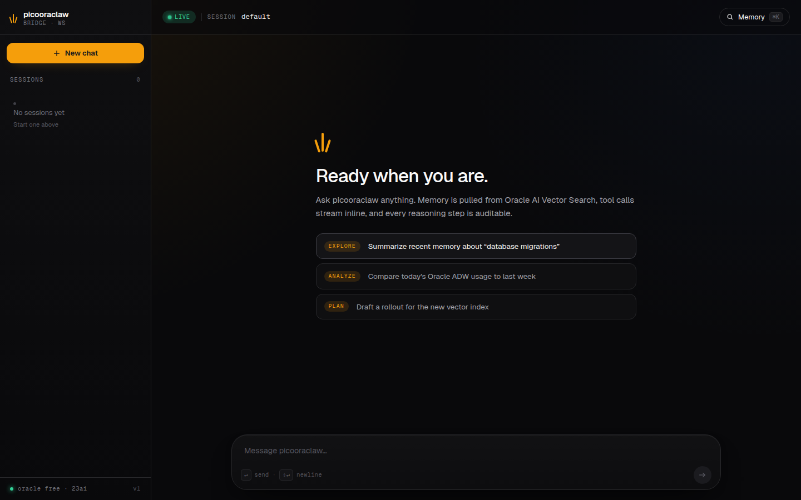
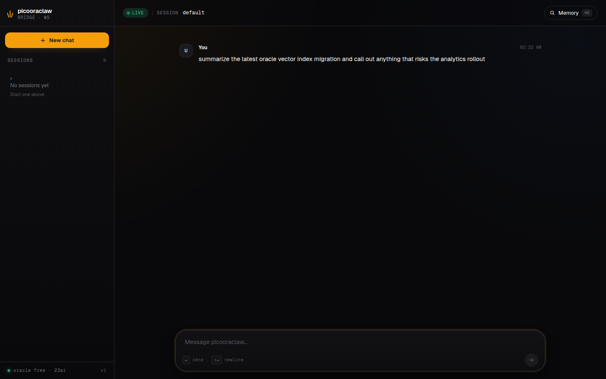
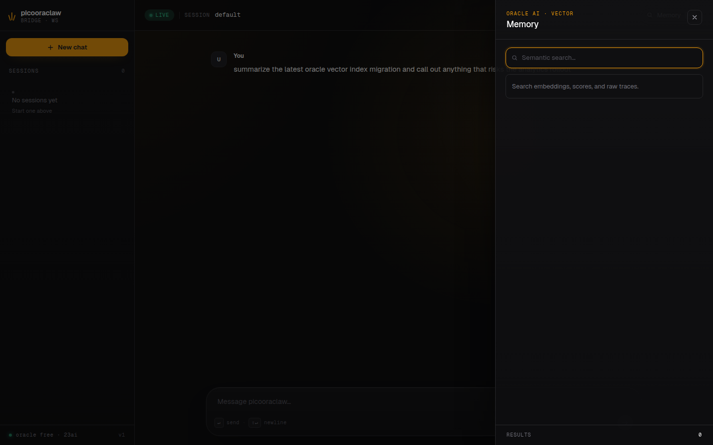
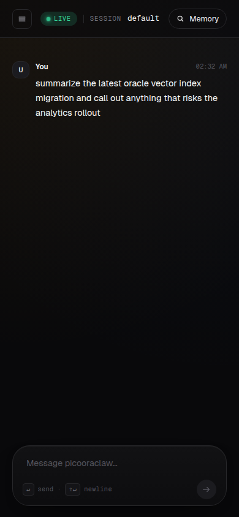

# picooraclaw-webui

A browser UI for [picooraclaw](https://github.com/jasperan/picooraclaw), the Oracle-backed autonomous agent. Stream reasoning events, browse memory, and drive sessions from your laptop.



## Screenshots

A quick tour of the interface (zinc-950 base, single amber accent, Geist throughout):

| Welcome | Conversation |
|---|---|
|  |  |

| Memory drawer | Mobile |
|---|---|
|  |  |

## What's inside

- **Go bridge** (`cmd/picooraclaw-webui`) — exposes picooraclaw's IPC socket over HTTP + WebSocket
- **SvelteKit frontend** (`web/`) — chat feed, tool-call cards, memory drawer, session sidebar
- **Oracle Database Free** — memory and session storage, bundled via docker-compose

## Quickstart

Prereqs: Docker (rootless or `sudo`), Go 1.24+, Python 3.10+, an `~/.oci/config` profile (the agent uses OCI Generative AI by default), and a sibling [picooraclaw](https://github.com/jasperan/picooraclaw) checkout.

```bash
# Place the two repos side-by-side and build picooraclaw once.
git clone https://github.com/jasperan/picooraclaw
git clone https://github.com/jasperan/picooraclaw-webui
(cd picooraclaw && make build && ./build/picooraclaw onboard)

# Boot the whole stack with one command.
cd picooraclaw-webui
./scripts/stack.sh up
```

That's it. **Open http://localhost:3000 and log in with password `demo`.**

`stack.sh up` is idempotent and on the first run it:

1. Starts the `oracle-free` container (gvenzl/oracle-free:latest, ~2 min cold start)
2. Sets SYS / SYSTEM / picooraclaw passwords and grants idempotently
3. Loads the `ALL_MINILM_L12_V2` ONNX embedding model into the DB via [onnx2oracle](https://github.com/jasperan/onnx2oracle) (built from HuggingFace, no PAR URLs)
4. Patches `~/.picooraclaw/config.json` to enable Oracle
5. Initializes the `PICO_*` schema (`picooraclaw setup-oracle`)
6. Starts the OCI GenAI proxy, the picooraclaw gateway, and this webui
7. Prints a public URL banner you can click

Subsequent `stack.sh up` runs detect what's already healthy and only start what's missing — typically returns in <2 seconds.

### Day-to-day

```bash
./scripts/stack.sh status     # health-probe each service
./scripts/stack.sh logs       # tail all service logs (.run/logs/*.log)
./scripts/stack.sh down       # stop webui+gateway+proxy (Oracle stays up)
```

### Override defaults

Common knobs (all optional):

```bash
WEBUI_PASSWORD=hunter2 \
WEBUI_PORT=8080 \
ORACLE_PWD=YourSecret \
PICOORACLAW_DIR=~/code/picooraclaw \
./scripts/stack.sh up
```

`SKIP_ORACLE=1` falls back to file-based memory; `SKIP_PROXY=1` if you prefer Ollama or another OpenAI-compatible LLM (configure it in `~/.picooraclaw/config.json`).

### Alternative: pure Docker (no host build)

If you'd rather not install Go / Python on the host, the bundled compose file runs everything in containers:

```bash
cp .env.example .env
docker compose up -d
```

This pulls a pre-built `picooraclaw` image rather than building from a sibling checkout. Edit `.env` to override `ORACLE_PWD`, `WEBUI_PORT`, or `ORACLE_PORT`.

## Development

Local hot-reload (no Docker for the bridge / frontend):

```bash
# Bring the supporting services up via stack.sh, then run the webui from source.
./scripts/stack.sh up
./scripts/stack.sh down   # stops only the compiled webui (gateway/oracle/proxy stay)

# Go bridge from source (replaces the compiled webui)
go run ./cmd/picooraclaw-webui --picooraclaw-url http://127.0.0.1:8090 --listen :3000 --password demo

# Frontend (separate terminal)
cd web && npm install && npm run dev
```

Frontend runs on http://localhost:5173 and proxies to the Go bridge on :3000.

## Testing

```bash
# Go unit tests
go test ./...

# Frontend unit tests
cd web && npm test

# Frontend smoke (requires running server)
cd web && npm run test:e2e
```

## Layout

```
cmd/picooraclaw-webui/  Go HTTP+WS server, embedded static assets
internal/               IPC client, session store, auth
web/                    SvelteKit frontend
scripts/stack.sh        One-command launcher (oracle + onnx2oracle + gateway + webui)
docs/                   Architecture notes and Phase 3 status
Dockerfile              Multi-stage: node → go → alpine (~35 MB runtime)
docker-compose.yml      oracle + picooraclaw + webui bundle
```

## Full end-to-end (manual)

The compose-level smoke test drives the live stack (Oracle + picooraclaw + webui) through login, sessions, and memory search. It's gated behind `E2E_COMPOSE=1` so CI doesn't run it by default (Oracle boot is ~2 min).

```bash
# Start the full stack and wait for everything to come up
./scripts/stack.sh up
./scripts/stack.sh status   # all five services should show http 200

# Run the compose-level Playwright smoke
cd web
E2E_COMPOSE=1 WEBUI_URL=http://localhost:3000 npx playwright test tests/e2e-compose.spec.ts
```

Set `WEBUI_URL` if you started the stack with a non-default `WEBUI_PORT`.

## License

MIT. See `LICENSE`.
